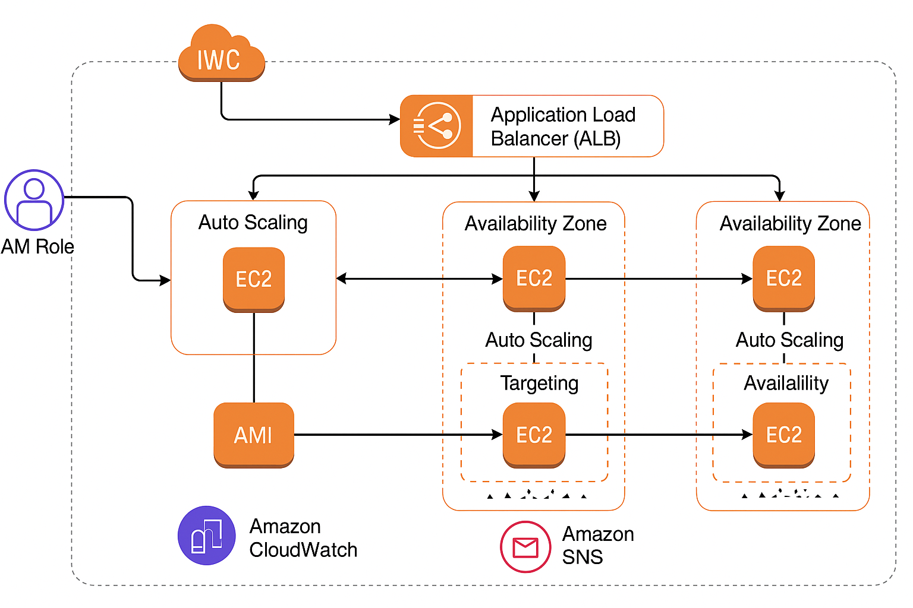

#Scalable Web Application on AWS using EC2, ALB, and Auto Scaling

Project Overview

This project demonstrates how to deploy a secure, scalable, and highly available web application on AWS.  
It’s based entirely on EC2 instances and uses Application Load Balancer with Auto Scaling Group to distribute traffic and handle load changes.
also IAM roles , CloudWatch, and SNS to enable monitoring and alerts.

--------------------------------------------------------------------------------------
1- Services Used

- **Amazon EC2** – Virtual machines to run the web application
- **Amazon Machine Image (AMI)** – Custom image of the configured instance
- **Application Load Balancer (ALB)** – Distributes traffic to EC2 instances
- **Auto Scaling Group (ASG)** – Automatically adjusts capacity based on demand
- **IAM Roles** – Provides EC2 instances permission to publish metrics to CloudWatch
- **CloudWatch** – Monitors EC2 performance metrics
- **SNS (Simple Notification Service)** – Sends email alerts when alarms are triggered
- **Security Groups** – Controls network access to instances and ALB

--------------------
2- Deployment Steps

1. Launched a basic EC2 instance:
   - Used Ubuntu AMI
   - Selected t3.micro (free tier eligible)
   - Placed in a public subnet inside a default VPC
   - Assigned a Security Group allowing inbound HTTP (port 80) and SSH (port 22) from my IP.
2. Installed and configured web server:
   - Connected to the EC2 instance via SSH using MobaXterm
   - Installed Apache using:
   
	sudo apt update
	sudo apt install apache2 -y
	sudo systemctl start apache2
	sudo systemctl enable apache2
   - Created a basic HTML file:
	echo "Hello from EC2 - $(hostname -f)" | sudo tee /var/www/html/index.html
	 
3. Created a custom AMI from the configured instance.
	-Created an Amazon Machine Image (AMI) from the configured EC2
   - This image was used to automatically launch identical instances in the Auto Scaling Group.
4. Created a Launch Template using the AMI.
    - Instance type (t3.micro)
     - same Key pair of original EC2.
     - Security Group (same as original instance).
5. Set up an Application Load Balancer with an HTTP listener.
   - Assigned at three Availability Zones and their subnets (`us-east-1a`, `us-east-1b`, `us-east-1c`)
   - Attached a new Security Group allowing HTTP (port 80) from anywhere (`0.0.0.0/0`)
6. Created a Target Group and linked it with the ALB.
7. Created an Auto Scaling Group using the Launch Template:
   - Attached it to the ALB
   - Selected same 3 Availability Zones with 3 subnets
   - Desired capacity: 2
   - Set scaling rules:
     - Min: 1
     - Max: 3
8. Created a custom IAM Role with CloudWatchAgentServerPolicy and attached it to the EC2 instance.
9. Set up a CloudWatch Alarm to monitor CPU usage.
   - Set metric: `CPUUtilization` for EC2
   - Condition: Greater than 70% for 5 minutes
   - Created a CloudWatch Alarm and attached an SNS action
10. Created an SNS Topic (`ec2-alerts`) to send email alerts when CPU usage exceeds 70%.
    - Topic name: `ec2-alerts`
    - Subscribed via email
    - Verified my email to receive alerts

11. Testing
    - Opened the ALB’s DNS name in browser:
      http://mnr-ALB-850733777.us-east-1.elb.amazonaws.com
  
    - Confirmed page was accessible and load balanced across EC2s
	
------------------------------------------------------------------------------------
Architecture Diagram

